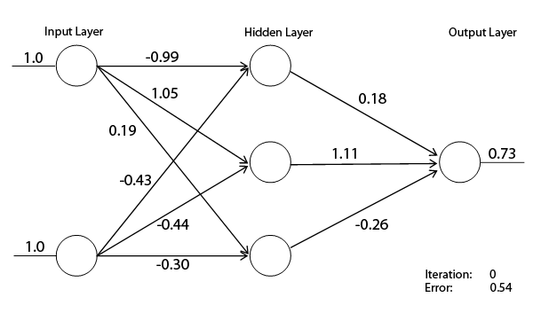

# Sales-Demand-Forecast
It is an sales demand forecast system for all sorts of business man using Backpropogation Neural Network

To understand the fluctuation in sales faced by businessmen of all levels and unable to predict the sales in future

PROBLEM STATEMENT : 
To understand the fluctuation in sales faced by businessmen of all levels and unable to predict the sales in future
SOLUTION
To create a prediction tool which can be used by businessmen of all levels irrespective of fields using Multi-Layer Neural Network based on historical sales data with an user interface.
OVERVIEW OF OUR SOLUTION:
BACKEND : 
Programming Language -  Python
Libraries used -  Scikit-Learn 
ML MODEL used -  Custom built BPN Multi-Layer Neural Network

NodeJS – Database connectivity and PyShell collaboration 
Database -  MongoDB

FRONTEND : 
User interface using Angular6.
Project Description: 
Understand of Problem statement :  We interviewed around 10 businessmen in Madurai who handle small to large level businesses
The companies we interviewed are 
1 . SSV retail Vegetable, Mattuthavani Vegetable Market – Mr. Selvaraj  (Small scale business)
2. Vegetable WholeSale Dealer, , Mattuthavani Vegetable Market – Mr. Thiagarajar (Small scale business)
3. Mukesh Shoe Mart , Anna Nagar -  Mr. Mukesh  (Small scale business)
4. S.K.P.P.K Maan Mark Supermarket,Anna Nagar -  Mr. Raj Kumar -  Medium Scale Business
5. Dress Store, Anna Nagar – Medium Scales Business
6. Medical Shop, K.K.Nagar -  Medium Scale Business
7. JigarThanda Shop, Anna Nagar -  Medium Scale Business
8.Cotton Mill – Kappalur – Large Scale Business
9. Wholesale Dress Dealer – Large Scale Business
10 . Electronic Appliances Dealer, Arrapalayam – Large Scale Business

MODEL:
The reason of using Back Propogation Neural Networks is because new variables can be added to the dataset at any time needed and priorities can be given to each and every variable so that when new variables can be added which gives more accurate value than before so that the work need not be started from base.

The input layer consists of number of neurons equal to the shape of X, there is a hidden layer between the input layer and output layer. The hidden layer consists of 3 neurons and the output layer consists of only one neuron which gives out the predicted sales values after succesful updations of the weights in the neural network through fprward propogation and back propogation methods.

OverView of the Application:
The UserInterface of this project is madeup of MEAN stack with ML python Integration using NodeJs.
In the Login Module all users can login using their unique emailID and password which will be stored in MongoDB
Users can add an existing CSV file of thier record for prediction which can be Daily,Weekly,Monthly,Yearly
Users can view the csv file using Angular web interface
The getprediction module takes the type of csv file and makes the sales demand prediction and will be diaplyed in the front end using Angular6
